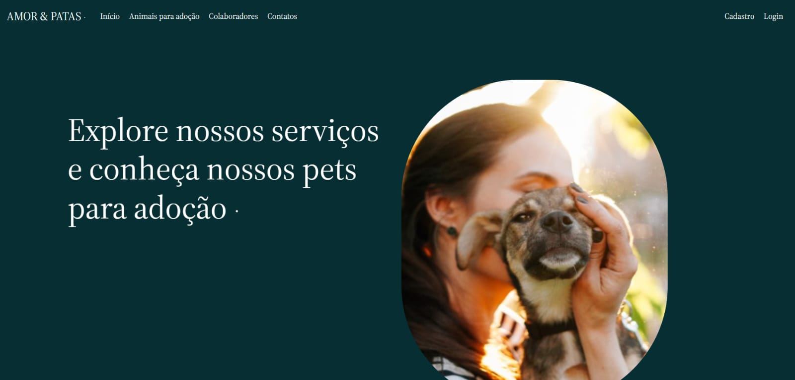

# Bootcamp Back-end Python e Django

## Projeto Final: AMOR & PATAS - Sistema de abrigo para animais  

  

  AMOR & PATAS foi construído como um sistema de gerenciamento de abrigo para animais, permitindo o cadastro de espécies, raças, portes e gêneros e por fim de animais, e também o cadastro de colaboradores do abrigo (voluntários e cuidadores), estes cadastros são realizados apenas por um administrador. Na aplicação aberta ao público estão as páginas de início, a lista de animais disponíveis para adoção, uma breve apresentação dos colaboradores do abrigo e a página de contatos que permite enviar uma mensagem/dúvida para os responsáveis pelo abrigo. Já aos usuários logados é permitido fazer a solicitação de adoção de um dos animais cadastrados a partir de um formulário, o usuário também pode acompanhar o status da sua solicitação. O cadastro pode ser realizado por qualquer pessoa interessada, sinta-se à vontade. Mas tenha em mente que este é um site fictício realizado a fim de aprendizado.

 

### Tecnologias Utilizadas

Esse projeto foi desenvolvido com as seguintes tecnologias:

- HTML e CSS
- Bootstrap
- Git e Github
- Python
- Framework Django

### Projeto

AMOR & PATAS é um site de um abrigo para animais.

- [Acesse o site aqui!](https://hevelinmiranda.pythonanywhere.com/)

 
<strong>
  PS: TODAS AS INFORMAÇÕES CONTIDAS NESTE SITE SÃO FICTÍCIAS!
</strong> 
